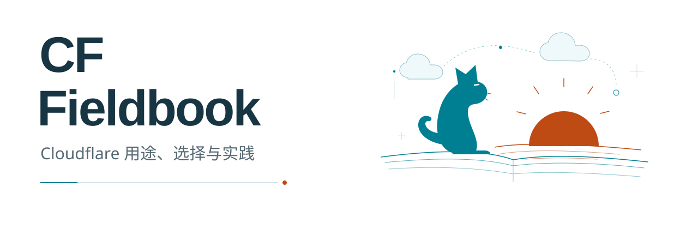

# CF Fieldbook

[](https://indeliblevivi.github.io/cf-fieldbook/)

**Cloudflare® 服务的用途、选择与实践参考。**

从手边的问题出发，认识相关服务，读实际系统遇到的故障与取舍，再运行一个能检查的小例子。面向个人开发者、独立创作者与协作 agent；这是 Faye & Cove 编辑的独立参考，不是 Cloudflare 官方文档或一键部署平台。

[在线阅读](https://indeliblevivi.github.io/cf-fieldbook/) · [源码仓库](https://github.com/IndelibleVivi/cf-fieldbook) · [作品与版本](https://indeliblevivi.github.io/cf-fieldbook/publications.html) · [变更记录](CHANGELOG.md)

正文以中文为主，Markdown 本身可以阅读；静态网站提供目录、来源跳转和本地搜索。代码、来源和出版工具留在同一仓库，便于在判断改变时找到受影响的内容。

## 从这里读

| 我现在想做什么 | 从这里开始 | 读完或运行后得到什么 |
|---|---|---|
| 看服务在真实系统里怎样配合 | [三篇实践记录](practice/README.md) | 私有资料站的交付与检索、Access/PWA 重连、Tunnel 状态页的分层检查 |
| 给网页、API 或已有服务选入口 | [个人基础设施实践手册](guides/handbook.md) | 画清请求、身份、程序与数据的路径，再选择需要的服务 |
| 理解任务为什么登记了却没完成 | [任务中断与恢复](use-cases/recoverable-jobs.md) | 看见租约恢复、迟到拒绝与未知结果，知道哪些动作不能盲目重试 |
| 让模型建议下一步，而由程序控制执行 | [有限决策与下一步动作](use-cases/bounded-decision.md) | 区分模型建议、允许的动作与需要检验的误判 |
| 比较 Clef、Jev 与接入路线 | [服务页](services/decision-models.md) · [Clef / Jev 专题](comparisons/clef-vs-jev.md) | 在同一任务下比较模型与供应路径，不把价格当作正确率 |
| 判断本期产品变化是否影响自己 | [2026-10-03 新发布观察](reports/2026-10-03.md) | 读观测、PiHarness、互联网搜索与临时分享，区分现在可用与未来计费 |
| 先做完一个可读的小项目 | [三份文档的小资料架](examples/reading-shelf/README.md) | 直接阅读、下载合成文档，沿同一份材料继续理解权限、更新、任务与检索 |
| 运行例子，或把检查交给 agent | [四个离线例子](examples/README.md) · [恢复任务单](templates/job-recovery-task.md) | 用合成输入取得实际输出、失败证据与清理结果 |

不熟悉的词可以先查[术语小词表](docs/glossary.md)。需要精确配置、命令或完整状态约束时，从对应例子进入[实施参考](reference/implementation.md)。

## 先运行一个真实机制

**[先体验任务恢复模拟 →](https://indeliblevivi.github.io/cf-fieldbook/examples/job-state/demo.html)** 在浏览器选择合成情景、推进或回放时间，观察领取代次、租约和任务状态的变化。它是静态阅读站上的交互教学，不连接云服务。

只需 Python 3.11+，不登录、不联网、不调用模型：

```sh
python3 examples/job-state/demo.py
```

演示会打印：任务登记后仍是 `pending`；worker 退出后，新的执行者等待租约到期再领取；旧 generation 的迟到完成被拒绝；外部响应丢失后进入 `uncertain`，重复领取不会自动重放。临时 SQLite 在结束时清理。它验证一个恢复机制，不是完整云端队列实现；[使用边界](examples/job-state/README.md)也明确列出没有解决的外部动作崩溃窗口。

按[例子说明](examples/job-state/README.md)运行现有测试，可检查状态变化和重开数据库后的结果；[恢复任务单](templates/job-recovery-task.md)给出可直接交给 agent 的离线步骤。网页模拟、本地模型检查与实际云端恢复是三种不同证据，本仓库没有把前两者写成云端实测。

## 在本地阅读

Python 环境只负责生成静态文件，阅读页面不需要后端：

```sh
python3 -m venv .venv
.venv/bin/python -m pip install -r requirements-render.txt -r requirements-design.txt
.venv/bin/python tools/build_site.py
python3 -m http.server 8767 --bind 127.0.0.1 --directory .build/site
```

在浏览器打开 `http://127.0.0.1:8767`。依赖安装需要软件源网络；构建与阅读本身不请求云 API，没有追踪、登录或付费执行入口。也可直接阅读仓库 Markdown。网站的生成、附件与撤下规则见[阅读站说明](docs/reading-site.md)。

## 内容如何维护


[Mermaid 源码](diagrams/src/architecture.mmd) · [全部六张图](diagrams/README.md)

解释归 Markdown，跨页精确数据归 `catalog/`，执行行为归 `examples/`。三部作品的源条目、封面、章节类型与服务阅读入口归 `catalog/publications.json`；稳定章节 ID 与可见编号分开维护。网站与 PDF 读取这些来源；事实核验、代码测试和云端实测分别记录。服务页持续维护，带截止日期的报告保留当时判断。后来的改价不自动回写历史报告。

```sh
python3 tools/fieldbook.py impact data.decision-routes
python3 tools/fieldbook.py due --as-of 2026-11-01
python3 tools/fieldbook.py check
python3 tools/check.py
python3 tools/content.py check
.venv/bin/python -m unittest discover -s tests -v
node --test examples/health-worker/worker.test.mjs
```

Node.js 20+ 用于 Worker 测试；Mermaid 只在修改图示时需要安装。[贡献与维护](CONTRIBUTING.md)给出依赖、修改位置与验证方法；[出版流程](docs/publication.md)说明共源数据和冻结版次的构建。

## 状态与边界

这是持续编辑的 source-available 参考仓库；具体实现、验证和未启用能力见[当前状态](docs/current-state.md)。手册与报告按各自来源截止日期阅读；[实践记录](practice/README.md)匿名重构作者维护过的系统，保留历史观察日期，并链接相关官方机制文档。局部工程验证不能代表全篇事实或历史系统重新核验。旧三册 Markdown / HTML / PDF 固定保留在 `dist/`，用于历史阅读；新构建进入 `.build/`，不覆盖旧版。

公共例子使用合成输入，没有账号凭据或真实运行数据。阅读站由 GitHub Pages 托管，主分支通过检查后自动更新。搜索在浏览器内完成，不向搜索服务发送查询；站点不嵌入统计脚本或远程字体。云端实验、定期上游监控和新版出版物 Release 独立于网站部署。

原创功能代码采用 [SUL-1.0](LICENSE)；原创正文、出版物、独立图形和资料编排采用 [CC BY-NC-SA 4.0](LICENSE-DOCUMENTATION.md)。这是一份 source-available 项目，不是无商业使用限制的 OSI 开源软件；具体路径与第三方例外见[许可与权利范围](LICENSE-STATUS.md)。

[项目规格](SPEC.md) · [架构](docs/architecture.md) · [生命周期](docs/lifecycle.md) · [内容设计](docs/content-design.md) · [来源说明](docs/provenance.md) · [AGENTS](AGENTS.md)

Cloudflare 及相关产品商标属于 Cloudflare, Inc.；本项目与其没有隶属、赞助或背书关系。

---

GitHub · [github.com/IndelibleVivi](https://github.com/IndelibleVivi)  
*made by Faye & Cove*
