# 架构：不同材料怎样进入同一本 Fieldbook

本文描述当前编辑与本地出版机制。静态阅读站与 edition freeze 已实现；云端实验适配器仍未实现。实施边界见 [当前状态](current-state.md) 与 [迁移表](migration-r3.md)。

## 整体结构



[Mermaid](../diagrams/src/architecture.mmd)

来源材料不是给 agent 执行的指令。编辑者从来源中选择、核实和解释；公网公告与私人操作记录之间没有“复制进仓库”的自动连接。私人材料在仓库外完成脱敏，产物才进入正文或合成例子。

Markdown 保存解释；catalog 保存跨页复用的精确记录；源码保存可运行行为。构建消费它们，而不是修改它们。读者能沿链接回到相应编辑源。

## 单一归属

| 对象 | 编辑位置 | 消费位置 | 不允许的第二归属 |
|---|---|---|---|
| 比较结论、因果、解释 | guides / services / comparisons 等 Markdown | README、网页、PDF | 单独维护同义的“机版结论” |
| 精确模型路线与价格 | catalog/decision-routes.json | 比较表、费用算术、示例输入检查 | 在渲染器里手写另一张价格表 |
| 作品编排与章节类型 | catalog/publications.json；正文稳定 chapter 标记 | 网页入口与独立冻结版次 | renderer 按章序号／日期再存一份清单 |
| 来源书目 | catalog/sources.json | 来源索引、核验记录 | 导出 HTML 的无来源数字 |
| 内容身份与依赖 | catalog/entries.json | 导航、影响查询、到期队列 | frontmatter 另存一份同样依赖 |
| 请求外壳、任务状态 | examples 内的源码 | 例子执行、引用或一致性测试 | 文内粘贴后独立修改的算法 |
| 图的结构和文字 | diagrams/src/*.mmd | assets/diagrams/*.svg | 手工移动 SVG 节点后不更新源码 |
| 装饰 | assets/motifs 独立 SVG | 封面、封底、少量细节 | 让装饰成为状态唯一编码 |
| 私人运行与凭据 | 仓库外 | 明确获准的运行节点 | tracked .env、真实配置、原始运行日志 |

Observability 费用由明确资料日期和公告生效事件生成；当前条款与已公布未来条款分开，构建时钟不替代核验日期。

决策模型的精确表格已由 `tools/content.py` 共源到三个维护页；其他事实仍有正文编辑责任。只按真实共享与更新需要继续提取，不宣称全库字段已结构化。

## 关系的方向

内容目录使用稳定 ID：`service.decision-models`、`compare.clef-jev`、`example.job-state`。`path` 是所在位置，迁移路径不需要重新发明身份。

`depends_on: [x]` 表示 x 变化时此条目需要列入影响候选；它不是“提到过 x”。`related` 是读者探索的旁路，不参与影响闭包。价格来源变化可能影响比较；与比较相关的一篇闲谈，不因此自动变成更新目标。



[Mermaid](../diagrams/src/change-impact.mmd)

影响查询只选择候选文件，不改正文、不刷新日期。当前粒度是内容条目或数据文件。以后确有必要再增加字段级 fact ID，不先建设知识图谱。

## 最小内容记录

```json
{
  "id": "compare.clef-jev",
  "kind": "comparison",
  "path": "comparisons/clef-vs-jev.md",
  "track": "maintained",
  "status": "current",
  "depends_on": ["data.decision-routes"],
  "related": ["usecase.bounded-decision"],
  "review": {
    "checked_on": "2026-10-02",
    "scope": "继承 r3 的官方来源核对；本次未再次核对",
    "next_review_on": "2026-10-16"
  },
  "evidence": [{"kind": "prior-edition", "ref": "docs/provenance.md"}]
}
```

这里的复核日是本仓库的编辑建议，不是服务商承诺。任何一项云端执行证据另写环境和日期，不能从 `status: current` 推导。

## 人与机的两个入口，不是两份内容

人从 README 和 guides 阅读；机先读 AGENTS，再按任务进入对应的 reference、源码、元数据与核验记录。两者都需要正确事实，但阅读任务不同。

给机的界面应简短、有精确路径、有可运行检查。不要把全部长篇出版规范塞进 AGENTS；也不要把人的文章全部改成命令清单。

## 网站与仓库的关系

网站是只读出版投影。内容保持静态可导出，先不需要账户、数据库或云端编辑后台。站点导航由内容索引生成，目录与正文搜索在浏览器本地运行，只索引当前允许的阅读条目；不发送查询。

如果网站部署到 CF，网站代码和发布配置只服务这个阅读站；它不获得运行所有 examples 的权限。示例云资源与网站生产资源不能共用一把万能 token。

静态构建、发布平台、PDF 引擎都可以替换；Markdown、精确记录、源码与来源关系不随框架一起丢失。
