# 生命周期：什么变了，接下来该动哪里

## 内容、复核和证据分开

一条已发表内容在复核期间仍可以保留上一版；不能一发现上游变化，就把读者正在使用的版本变成半写好的草稿。旧版、候选修订和对外发布是不同对象。

[Mermaid](../diagrams/src/content-lifecycle.mmd)

| 内容状态 | 读者看到什么 | 允许怎样离开 |
|---|---|---|
| draft | 默认不作为推荐入口；需要时以明确草稿分享 | 审阅后 current，或取消 |
| current | 当前解释与最后核验范围 | 新版替代、进入复核、停用或紧急撤下 |
| superseded | 明确提示新版位置；保留历史链接 | 进入归档，不再冒充当前指南 |
| withdrawn | 停止分发执行附件，入口给安全说明 | 修复并重审后另发 revision，或永久撤下 |
| archived | 有日期的历史资料，不进入默认“怎么做”路径 | 新证据产生新条目；不是偷偷恢复推荐 |

`needs_review` 是复核队列信息，不另造一条与内容状态冲突的发布状态。一个 current 例子可以暂时需要复核；但已知会造成损失的操作不应继续作为当前推荐，先撤下执行入口。

## 上游事实发生变化

维护者先保存“什么变化、来源在哪里、什么时候生效、哪些说法受影响”。来源页面 HTTP 200、内容 hash 变化、机器人摘要，都只能构成信号，不能自动构成核验完成。

确认事实后，更新它的单一归属；用依赖查询找当前内容和例子。当前条目检查是否改正文、改命令或改适用条件；历史快照只检查是否需要勘误。`related` 链接只列为可能要看，不会递归改写。

建议采用可配置复核节奏：价格/候补/比赛截止等易变材料约 14 天，API 与 beta 路线约 30 天，稳定概念约 90 天。临近费用生效、关键接口迁移或首次发布时提前核对。到期只是提醒；没有“超时就删除一切”的定时器。

## 证据记录

证据记录至少包含对象、时间、输入种类、环境、观察结果和局限。不同对象的证据不能自动升级整篇作品。

| 证据 | 可以说 | 不能由此推导 |
|---|---|---|
| 来源核对 | 指定文档在指定日期写了某事实 | 账户有权限、服务能连接 |
| 本地执行 | 指定环境与输入通过了某检查 | 真实 API 成功、所有语言相同 |
| 云端执行 | 指定账户/区域/版本的那次试验观察到了结果 | 别人的环境一样、未来一直可用 |
| 视觉检查 | 指定尺寸下检查了阅读与图示 | 已实现完整可访问性合规 |
| 编辑审阅 | 资料的解释、条件与呈现经过维护者审阅 | 全部底层服务获得质量认证 |

生产输入不放进公共证据。用 opaque run ID、版本、摘要和安全结果描述，但不要声称 hash 自动保证匿名。无法脱敏的证据留在仓库外，公共材料明确其可检查范围。

## 示例资源生命周期

[Mermaid](../diagrams/src/example-lifecycle.mmd)

每个可执行例子用 `example.meta.json` 说明默认路径、网络、凭据、运行与检查命令。离线例子明确 `live_supported: false`，不是留下一个隐蔽的部署 fallback。

云端实验若以后实现，创建前列出预算上限、最长执行时间、实例上限、资源命名、允许出站与清理责任；资源 ID 写进仓库外的运行 receipt。运行失败、超时、取消，都要进入 finally 清理与读回；进程被杀后还需要独立的资源复核路径，不能只依赖 finally。

删除请求成功不等于资源已消失，资源消失也不等于账单完成出账。清理读回保存观察范围；失败时状态为 cleanup-required，保留资源台账和手动命令。重试相同外部动作前先核对上次状态，不换一个新 ID 当作没发生过。

定期资源 sweeper 只能按本例子的标签/前缀/租约清理明确临时资源，不能扫描全账户随便删。公共 CI 默认无生产凭据，不能替人批准付费动作。

## 从个人实践到公开材料

顺序是：在私有环境总结机制 → 写公共安全叙述 → 构造合成输入 → 本地复现 → 检查叙述与结果匹配 → 人确认公开。不要把私人运行目录放进 repo 再依赖 ignore。

稀有时间序列、完整拓扑、对象 key、截图边角、signed URL、旧域名注释均需要检查。例子还要扫描包中隐藏文件、产物、SVG/HTML metadata 和出站引用；当前路径脱敏不代表 Git 历史已安全。

## 停用、撤下和移交

上游停服或例子失修：更新 current 入口与替代链接，停止默认执行和推荐，保留必要解释；冻结可引用版本。没有替代方案可以直接写“不再维护这条路线”。

内容错误：发布 erratum，定位受影响条目与版次，说明旧说法、改动与原因。危险操作或私密信息暴露：先撤下，随后修复；不要为了版本完整性继续散发问题字节。

维护者暂时无力维护：导出可读源、已知缺口和最后核验范围，停用付费实验与自动公开发布。给读者明确状态，不需要维持一个永远亮绿灯的假象。
