# 出版：从可编辑资料到可引用版本



[Mermaid](../diagrams/src/publication.mmd)

## 当前资料与历史报告

`tools/content.py` 从 `catalog/decision-routes.json`、来源索引和例子中的成本函数生成决策模型维护页的显式 fact blocks；Observability 费用由 `catalog/observability-pricing.json` 与 `catalog/launches.json` 的生效事件共源到手册和观测页。只有 `sync` 会修改这些块；`check` 发现漂移并失败。叙述与结论仍由编辑者维护，不能因为数字同步就推定解释仍成立。

```bash
python3 tools/content.py sync
python3 tools/content.py check
```

构建阅读站时使用只读投影；正式冻结前要求源中的 fact blocks 已同步并经过审阅。模型、入口、选择器、价格、tokenizer 和上下文都取自同一记录，未知费用不作零计算。估算是给定计费 token 数的乘法，不是跨模型同文本 token 数相同的承诺。

`reports/` 拥有自己的历史文字与来源定义，不参与上述同步；报告重排时也从自己的定义生成书目。旧 `dist/` 继续保留 r3 bytes，构建不会覆盖它。之后的改价或开放状态变化进入当前维护页，只有原报告在当时已经错误才作勘误。

## 独立冻结作品

`catalog/publications.json` 拥有作品的源条目、封面、章节类型与服务入口；Markdown 拥有正文和稳定 chapter 标记。章节编号只是显示顺序，重排不改变章节身份。报告日期与文件名由所选正文身份生成，新一期报告无需修改 renderer。

2026.10 首发三册使用完整实践手册、Clef / Jev 专题和[新发布观察首发选编](../reports/2026-10-first-release.md)。`launches.source_entry` 显式选择选编稿；它保留 10 月 2 日报告的选题范围，按主题吸收 10 月 3 日四组更新。两篇历史报告保持自己的身份和正文。选编的 10 月 5 日编辑与定向核查，不刷新所有继承来源；另外两册也不因此统一修改事实日期。

本地准备首发三册时，显式选择三作品并使用尚未占用的候选 ID，例如：

```bash
.venv/bin/python tools/editions.py freeze first-release-20261005-r1 --all
.venv/bin/python tools/editions.py build first-release-20261005-r1 --all
.venv/bin/python tools/editions.py check first-release-20261005-r1-handbook
.venv/bin/python tools/editions.py check first-release-20261005-r1-comparison
.venv/bin/python tools/editions.py check first-release-20261005-r1-launches
```

制作图文附件时，从这次通过检查的各册 `outputs/` 精确选择 PDF，再从同一文件提取封面。不要整目录复制 `.build/`，也不要把旧 r3 封面配到新正文。附件身份与核验范围随实际候选记录；本地交付不等于 GitHub Release 或社交平台发布。

先按[贡献说明](../CONTRIBUTING.md)安装依赖。默认只冻结当前观察；用 `--publication` 明确选择 `handbook`、`comparison` 或 `launches`：

```bash
.venv/bin/python tools/editions.py freeze handbook-20261003-r4 --publication handbook
.venv/bin/python tools/editions.py build handbook-20261003-r4
.venv/bin/python tools/editions.py check handbook-20261003-r4
```

只生成 Markdown 与 HTML 时，build 加 `--formats md html`。每个候选 ID 只能使用一次，已有输出不可覆盖；修改后使用新 ID。build 的作品选择来自冻结 manifest，不读取工作树的编排。

需要一次生成三册时：

```bash
.venv/bin/python tools/editions.py freeze fieldbook-20261003-r4 --all
.venv/bin/python tools/editions.py build fieldbook-20261003-r4 --all
.venv/bin/python tools/editions.py check fieldbook-20261003-r4-handbook
.venv/bin/python tools/editions.py check fieldbook-20261003-r4-comparison
.venv/bin/python tools/editions.py check fieldbook-20261003-r4-launches
```

`--all` 创建三个独立候选，并在组目录的 `edition-set.json` 保存成员；后续 build 使用该冻结成员表。只修改专题，不必重新构建另外两册。

产物留在 `.build/editions/<id>/`，不自动进入 Git 或阅读站：

- `inputs/`：该作品实际引用的正文、practice、例子附件、图示，以及词表、来源和所需样式／工具；不收录整个维护正文目录。freeze 只检查所选阅读闭包的事实块，其他作品的编辑不会阻塞单册候选。
- `outputs/`：所选作品的 Markdown、HTML、PDF。
- `edition.json`：作品身份、固定 `as_of`、来源 commit、输入／输出身份与排版环境。`as_of` 取源正文 source_cutoff，不用构建时钟刷新事实。

输入摘要是内容身份的依据，commit 只是辅助来源，未提交的输入也如实记录。冻结后的渲染使用 `inputs/tools/render.py` 和快照里的数据、图与样式，不读取工作树的实时材料。编辑源、原有 PDF 与核验日期不会被构建改写。输入清单、摘要或已生成输出不符时，检查失败。

手册引用的词条会从冻结词表提取首段，附在该册的“术语小词表”中；Markdown 与 HTML／PDF 的词义链接指向本册定义。之后更新网站词表不会改变已冻结的解释。网页交互演示不打包为 PDF 交互，出版物仍用于连续阅读。

快照固定内容和渲染代码，不打包 Python、浏览器或字体。依赖按记录安装；跨系统排版可能不同，要重新视觉验收，不能承诺 PDF 跨平台逐字节重现。同册链接转换为文内锚点，其他正文、例子与附件转换为正式阅读站地址。封面及篇尾给出本册版本／更新页，篇尾另有当前阅读入口，页脚带轻量版次；没有本机 `file:` URI。渲染禁止远程资产请求，既不补抓事实，也不调用云端例子。

PDF 在文件内嵌入字体；HTML 仍使用阅读设备自己的字体。`tools/render.py` 的 `embed_compact_cid_fonts` 在 WeasyPrint 写文件前，把 Adobe-Identity-0 且 CID 与 glyph index 一致的 CFF 字体按 `CIDFontType0C` 嵌入：直接保留原 CFF table bytes，只改变 OpenType 外层封装，不重编字形、不改文字映射、正文流、链接或书签。它处理本机 PingFang SC 在 PDFKit / Quick Look 下缺字和错字形的兼容问题；TrueType、其他 CFF charset 与 name-keyed CFF 保持原封装。`fonttools` / `pydyf` 使用现有渲染依赖，版本随 edition 记录；不分发独立系统字体文件。

字体已嵌入、`pdftotext` 输出正确仍不足以证明显示正常。PDF 字体或 renderer 变更后，至少用 Poppler 和目标设备的原生预览打开正文页，检查中文、Latin、粗体、表格与目录；macOS 使用 Preview / Quick Look，iPhone 使用实际分发入口。macOS 原生检查通过不能写成 iPhone 微信已验证。修正版使用新候选 ID；旧冻结输入、输出与 `dist/` 不覆盖。

## 当前阅读、版本与下载

阅读站提供[作品与版本入口](https://indeliblevivi.github.io/cf-fieldbook/publications.html)及每册的版本页。`catalog/publication-releases.json` 分别拥有当前编辑修订、固定历史版链接和已分发版登记；编辑修订按作品关联，不把任意 repo commit 当成该册过期。专题的新增任务说明属于编辑修订，不刷新模型事实日期。

当前新候选未登记为 Release，没有新版“latest PDF”下载；版本页可以回访当前正文和固定 r3 的真实文件。登记文件只提供经过审阅的公开链接与版本信息，不自动复制 `.build` 文件。公开新的文件前先执行候选 check、检查实际 PDF、确认许可／来源范围及发布授权，再登记具体分发文件；不能把候选路径或未经检查的文件标成 latest。已分发登记包含 `id`、`family`、`edition`、`state: released` 和 `files`；每个格式记录真实 HTTPS URL 及 check 对应输出的 `sha256`。`latest` 按 family 指向登记 ID；候选状态、无文件身份或错误家族指针会使站点构建失败。登记验证检查引用和身份格式，实际文件审阅仍由前述 check 与 PDF 检查完成。

## 检查、分发与撤下

普通检查包括元数据、引用与依赖、例子测试、算术、事实块一致性，以及图示源与产物同步。页面和印刷样式变更还需要实际视觉检查。结构检查不能证明事实为真；本地例子通过不能证明云服务表现。

`.build/editions/` 是本地候选快照，不是可以整目录自动公开的 release 包；它含构建输入和例子。公开前审阅具体 revision、许可、核验范围及待分发文件。对外分发出版物时同时带上仓库的 `LICENSE`、`LICENSE-STATUS.md` 与 `LICENSE-DOCUMENTATION.md`，或在作品内保留可访问的许可与范围链接；旧冻结版不自动补写新通知。静态站仅分发当前允许的内容及明确附件，见 [阅读站](reading-site.md)。旧版本的撤下需要同时处理既有站点、附件、下载和缓存；修改索引不会远程清除曾经发出的文件。

云端示例实验的预算、资源、目标与清理独立于出版构建。网站的部署与回退见[阅读站运行说明](reading-site.md)；生成新的 edition 不会自动创建 GitHub Release 或上传其文件。

## 图与署名

Mermaid 结构和文字只在 `diagrams/src/` 编辑；SVG 是阅读投影。`assets/diagrams/manifest.json` 记录源、配置、产物摘要和实际引擎版本。摘要用于发现漂移，不能证明图的语义正确。升级引擎后重建并逐图检查，操作见 [图示说明](../diagrams/README.md)。

封面写作品名、日期和版次，作者为 Faye & Cove。GitHub 以明确地址呈现；文末为 *made by Faye & Cove*。来源、署名和许可各自独立，不从署名推定公开授权。
